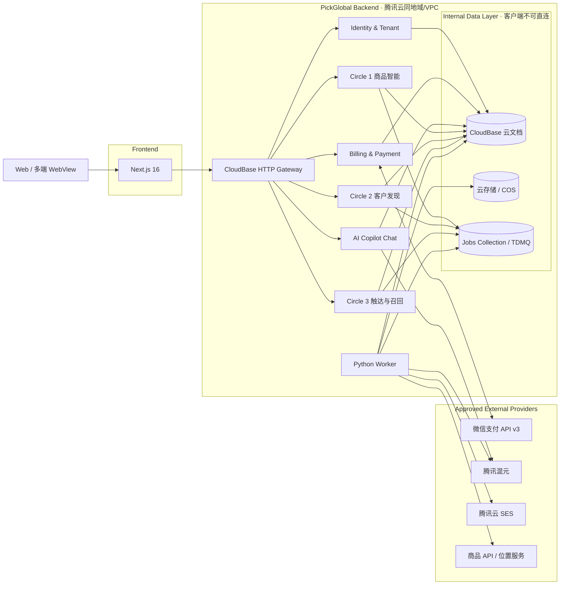
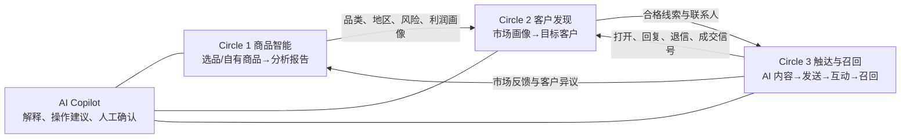

# PickGlobal 后端技术方案

本文基于 [front.md](front.md) 的产品流程、[project.md](project.md) 的国内云约束，以及当前 `front/` 中实际使用的 Next.js 16.3.3 设计。

目标是先交付可演示、可上线的国内技术栈，同时为 10 万、100 万以上用户的扩容保留清晰路径。


---

## 1. 设计结论

- 官网与工作台：现有 `front/`，Next.js 16 + TypeScript。
- 主业务 API：Python 3.12 + FastAPI + Pydantic 2。
- API 运行方式：Docker 部署到腾讯云 CloudBase 云托管。
- 异步任务：Python worker；MVP 由云函数/定时任务触发，S2 接入 TDMQ。
- MVP 数据库：CloudBase 云文档，不单独购买 MySQL。
- 文件：CloudBase 云存储或 COS，数据库只保存对象 key 和元数据。
- AI：腾讯混元，只从后端调用；提供业务 Copilot 对话和三大核心模块的生成能力。
- 支付：微信支付 API v3；Web 桌面端先用 Native 扫码，微信内用 JSAPI，通过 adapter 保留支付宝扩展位。
- 计费：套餐、支付订单、订阅、权益、额度、用量分离，支付成功只以验签回调或主动查单为准。
- 邮件：腾讯云 SES，只从 worker 调用。
- 商品与客户数据：国内合规数据 API + 腾讯位置服务，通过 provider adapter 隔离。
- 鉴权：CloudBase 身份认证；前端取得用户令牌，FastAPI 服务端校验。
- 部署边界：`web`、`api`、`worker` 分离，避免 AI、邮件等慢任务占用 API 请求。
- 默认不上 Java；扩容时迁数据库、队列和容器底座，不重写业务语言。

当前仓库中的 Next.js 版本是 16.3.3，因此后续配置应以实际代码为准，不按 `project.md` 中旧的 Next.js 15 描述降级。

---

## 2. 总体架构




数据库属于 PickGlobal 后端内部数据层：浏览器、WebView 和 Next.js 客户端都不能直接使用管理凭证访问。这里的“inside”指处于后端系统边界、同地域/VPC 和 repository 控制之内；数据库仍使用独立的 CloudBase 托管资源，不能放进 FastAPI Docker 容器。

同步接口只处理登录态、CRUD、查询和任务创建。以下工作全部异步执行：

- CSV 批量导入
- 商品和市场分析
- 混元报告生成
- 海外客户发现
- 邮件批量生成与发送
- SES 状态回调处理
- 流失识别与召回
- PDF 报告导出

### 2.1 后端组件划分

首版采用一个 FastAPI 模块化单体和一个独立 worker 进程，但代码上划分为九个边界清晰的组件：

1. **Identity & Tenant**：注册、登录、微信绑定、用户资料、企业租户、成员和 RBAC。
2. **Billing & Payment**：套餐、微信支付、订单、订阅、权益、额度、用量账本和对账。
3. **AI Copilot Chat**：业务对话、SSE 流式回复、上下文、工具调用、token 用量和安全护栏。
4. **Core Circle 1 · 商品智能**：商品导入、利润/税务/物流计算、市场机会和风险报告。
5. **Core Circle 2 · 客户发现**：客户搜索、归一化、去重、质量评分、名单管理。
6. **Core Circle 3 · 触达与召回**：活动、AI 邮件、审批、SES 发送、事件回流、流失召回。
7. **Database & Storage**：CloudBase 云文档、COS、repository、租户隔离、索引、事务和 MySQL 迁移。
8. **Jobs & Events**：异步任务、进度、幂等、重试、死信、webhook event 和对账。
9. **Gateway & Network**：同域路由、鉴权、限流、SSE、webhook、公网/VPC 边界和可观测性。

这些是逻辑组件，不是首版九个微服务。业务组件初期共同部署在 `pickglobal-api`，worker 单独运行，数据库/存储使用后端专属托管资源；达到明确扩容信号后再拆进程或服务。

### 2.2 三大核心模块闭环



闭环的关键不是把三个页面串起来，而是让第三模块产生的真实市场反馈重新更新线索分和商品判断。所有反馈都带来源、时间和关联 ID，避免 AI 凭空修改确定性数据。

---

## 3. 后端技术栈

### 3.1 API

- Python 3.12
- FastAPI
- Uvicorn
- Pydantic 2 + `pydantic-settings`
- `httpx`：异步 HTTP、CloudBase HTTP API、第三方 provider
- 腾讯云 Python SDK 3.0：SES、混元及其他腾讯云产品
- `structlog` 或标准库 JSON logging：结构化日志
- `tenacity`：仅用于可安全重试的外部调用
- `orjson`：大型分析报告的 JSON 序列化

生产环境固定依赖版本并提交 lock 文件。推荐使用 `uv` 管理依赖和虚拟环境；若团队已有 Poetry 标准，可统一使用 Poetry，但不要同时维护两套锁文件。

### 3.2 数据访问

CloudBase 服务端数据库 SDK 以 Node.js 为主。FastAPI 不应在业务代码里直接拼接数据库 HTTP 请求，而应通过 repository adapter：

```text
domain service
    ↓
repository protocol
    ├── CloudBaseDocumentRepository（MVP）
    └── MySQLRepository（S2）
```

MVP 的 Python 实现使用 CloudBase 官方 HTTP/OpenAPI 访问云文档，并集中完成：

- 腾讯云请求签名和凭证管理
- 超时、重试和错误转换
- 分页游标
- 事务封装
- 字段白名单
- 查询限制
- 结构化日志

不得把 CloudBase SecretId、SecretKey 或数据库管理能力下发到浏览器。

### 3.3 异步任务

MVP：

- `jobs` 集合保存任务状态。
- job 文档采用 `status + progress + steps[] + error + result_ref`，参考 `mvp_30` 的进度/子步骤模型，但必须持久化到云文档，不能使用内存 `Map`。
- API 创建任务后立即返回 `202 Accepted`。
- CloudBase 云函数或独立 worker 拉取并执行任务。
- 定时触发器负责流失扫描和失败任务恢复。

S2：

- TDMQ 替代集合轮询作为消息队列。
- `jobs` 集合或 MySQL 继续保存业务状态，不把消息队列当数据库。
- API、analysis worker、outreach worker 可独立扩容。

所有任务必须支持幂等、超时、有限重试和死信处理。

---

## 4. 服务边界

初期采用模块化单体，不提前拆微服务：

```text
backend/
├── app/
│   ├── main.py
│   ├── api/
│   │   └── v1/
│   ├── core/
│   │   ├── config.py
│   │   ├── auth.py
│   │   ├── errors.py
│   │   ├── logging.py
│   │   └── idempotency.py
│   ├── domains/
│   │   ├── users/
│   │   ├── tenants/
│   │   ├── billing/
│   │   ├── payments/
│   │   ├── chat/
│   │   ├── products/
│   │   ├── analysis/
│   │   ├── leads/
│   │   ├── campaigns/
│   │   ├── outreach/
│   │   └── recall/
│   ├── providers/
│   │   ├── hunyuan/
│   │   ├── wechat_pay/
│   │   ├── ses/
│   │   ├── location/
│   │   └── product_sources/
│   ├── workers/
│   └── schemas/
├── db/
│   ├── repositories/
│   │   ├── protocols.py
│   │   ├── cloudbase/
│   │   └── mysql/
│   ├── collections/          # 云文档结构、字段与验证规则
│   ├── indexes/              # 索引声明和创建脚本
│   ├── migrations/           # 云文档版本迁移；S2 增加 MySQL migration
│   ├── seeds/                # plans 等非敏感基础数据
│   └── transactions/         # 支付、额度等原子操作
├── net/
│   ├── gateway/              # 同域 /api 与 /webhooks 路由约定
│   ├── middleware/           # request-id、鉴权、限流、审计
│   ├── clients/              # CloudBase、混元、SES、微信支付 HTTP client
│   ├── sse/                  # AI chat 与 job progress 流协议
│   ├── webhooks/             # 验签、解密、去重和快速应答
│   └── policies/             # timeout、retry、TLS、CORS、VPC 策略
├── tests/
│   ├── unit/
│   ├── integration/
│   └── contract/
├── Dockerfile
├── pyproject.toml
└── uv.lock
```

模块规则：

- `api` 只处理 HTTP、鉴权、输入验证和响应转换。
- `domains` 保存业务规则，不依赖 FastAPI 或具体数据库。
- `db` 是 backend 内部数据层，集中管理 repository、collection、index、migration 和 transaction；隔离云文档与未来 MySQL。
- `net` 是 backend 内部网络层，集中管理入站网关、中间件、SSE、webhook 和所有出站 HTTP 策略。
- `providers` 隔离混元、SES、位置和商品数据源。
- `providers` 只做供应商语义转换，底层连接、超时、TLS 和重试统一复用 `net/clients` 与 `net/policies`。
- `workers` 复用 domain service，不复制业务逻辑。
- `app/domains` 只能依赖 `db/repositories/protocols.py`，不能直接调用 CloudBase HTTP API。
- 浏览器只能调用 `net/gateway` 暴露的 API；不能导入 `db`、`net/clients` 或管理凭证。
- 跨模块引用通过 service/protocol，不直接操作别的模块集合。

---

## 5. 核心业务流程

### 5.0 注册、登录与企业初始化

不复制兄弟项目中的自建密码/session 表。身份凭证交给 CloudBase 身份认证 v2，PickGlobal 只维护业务用户和租户映射。

```text
邮箱/手机验证码或微信登录
  → CloudBase Auth 完成注册/认证
  → 前端取得短期 accessToken
  → 请求 /api/v1/auth/bootstrap
  → FastAPI 校验 CloudBase token
  → 幂等创建 users + tenants + tenant_members(owner)
  → 初始化 free entitlement 和月度额度
  → 返回当前用户、租户、角色、套餐和剩余额度
```

登录方式按阶段开放：

- MVP：邮箱验证码或手机验证码；避免后端保存密码。
- Web 微信登录：CloudBase `wx_open` OAuth，必须校验 `state`；首次登录完成账号创建/绑定。
- 微信小程序：使用小程序身份进入同一个 CloudBase 用户体系，优先以 UnionID 做跨端绑定。
- 企业成员：由 owner/admin 邀请加入现有 tenant，不能每次登录都创建新企业。

服务端要求：

- CloudBase HTTP 网关对 `/api/*` 开启身份认证。
- FastAPI 从 Bearer token/网关身份中取得 `user_id`，校验 issuer、audience、过期时间和签名。
- token 只代表“是谁”，租户和角色仍由 PickGlobal 数据库判断。
- 注册、绑定、邀请接受和权限变更都写审计日志。
- 不生成 `Math.random()` token，不自建弱 session，不把密码哈希逻辑放进业务库。

### 5.0.1 支付、订阅与额度

首版使用微信支付 API v3：

- 普通浏览器/桌面端：Native 支付二维码。
- 微信内网页/小程序：JSAPI 支付。
- 支付宝作为后续 provider adapter，不阻塞 MVP。
- 套餐是一次性购买月/年周期；未签约代扣前不要宣称自动续费。

```text
选择套餐
  → POST /billing/orders（后端读取 plan 与价格）
  → 创建 PENDING payment_order
  → 调微信支付下单，返回 code_url/prepay_id
  → 用户付款
  → 微信 POST /webhooks/wechat-pay
  → 5 秒内验签、解密、校验订单号/商户号/币种/金额
  → 幂等写 payment_event
  → 原子更新 order + subscription + entitlement + quota ledger
  → 返回 200/204
  → 对账任务主动查单修复漏单
```

硬规则：

- 金额由服务端 `plans` 配置决定，绝不信任前端传入金额。
- 金额使用整数分 `amount_fen`，禁止浮点金额。
- 微信回调按官方 API v3 使用平台证书/微信支付公钥做 RSA-SHA256 验签；API v3 key 仅用于 AES-256-GCM 解密，不用于 HMAC 验签。
- 平台证书按 serial number 缓存并在过期前自动刷新；证书轮换参考 `mvp_1/lib/wechatpay/platform-certs.ts` 的 single-flight refresh 思路。
- 回调校验 `Wechatpay-Timestamp`，默认拒绝超过 5 分钟的重放请求。
- 唯一幂等键为 `provider + transaction_id`，订单号也必须唯一。
- 只有已验签回调或主动查单确认 `SUCCESS` 才能发放权益；前端“支付成功页”不能发权益。
- webhook 不做用户登录校验，但必须验签、限流、保留原始事件摘要并在 5 秒内应答。
- CloudBase 事务能力不足时，权益采用 append-only grant ledger；重复回调命中相同 grant key，不重复加额度。

权益模型将“付了多少钱”和“能用什么”分开：

```text
plan → payment_order → payment_event
                       ↓
                  subscription
                       ↓
                  entitlement
                       ↓
             usage_ledger / quota_balance
```

AI chat、商品分析、客户搜索、邮件发送分别扣自己的 quota。扣量使用“预占 → 成功确认 / 失败释放”，避免外部调用失败仍永久扣费。

### 5.0.2 AI Copilot Chat

AI Chat 是横跨三个核心模块的业务助手，不是独立闲聊机器人：

- Circle 1：解释报告、比较商品、生成分析建议。
- Circle 2：把自然语言转成线索筛选条件、解释线索评分。
- Circle 3：生成邮件/召回草稿、总结互动、建议下一步。

```text
用户消息
  → 校验登录、tenant、entitlement、速率和输入长度
  → 保存 user message
  → 读取最近消息 + 当前业务对象摘要
  → 调用混元 OpenAI-compatible API（stream=true）
  → FastAPI 以 SSE 转发 token
  → 保存最终 assistant message、模型、prompt_version、usage
  → usage ledger 确认扣量
```

SSE 事件统一为：

```text
event: start
event: delta
event: tool_call
event: usage
event: done
event: error
```

AI 工具权限：

- 默认可读：读取当前租户的商品、报告、线索、活动摘要。
- 需要确认：创建分析任务、加入线索、生成 campaign 草稿。
- 二次确认：发送邮件、购买套餐、删除数据、导出联系人。
- 永不允许：AI 直接改变支付状态、额度账本、角色或 webhook 结果。

每个 tool 在执行前重新做租户隔离和 RBAC，不能因为模型给出资源 ID 就跳过权限检查。上下文只放必要字段；不保存隐藏思维链，只保存最终答复、引用、tool result 摘要和 token usage。

### 5.1 商品导入与分析

```text
录入商品 / 上传 CSV
  → 校验、去重、保存 products
  → 创建 product_analysis job
  → worker 拉取商品、税务、物流、市场数据
  → 规则引擎计算利润与风险
  → 混元生成摘要和建议
  → 保存 analysis_reports
  → 前端轮询任务或通过 SSE 获取完成状态
```

计算型字段必须由确定性代码生成，不能完全交给大模型：

- 成本、售价、平台费用
- 税费和物流费用
- 毛利率、净利率
- 时效区间
- 风险评分基础项

混元只负责非确定性内容：

- 报告摘要
- 市场机会说明
- 风险解释
- 营销建议
- 邮件草稿

报告中保存 `model`、`prompt_version`、输入摘要、生成时间和规则版本，以便追溯。

### 5.2 客户发现

```text
分析报告 / 用户筛选条件
  → 创建 lead_discovery job
  → 调用国内数据源和腾讯位置服务
  → 统一字段、去重、质量评分
  → 保存 leads
  → 用户审核后加入 campaign
```

任何 provider 都必须实现统一协议：

```python
class LeadProvider(Protocol):
    async def search(self, query: LeadSearchQuery) -> LeadSearchResult: ...
```

业务层不得依赖某一家数据源的原始字段。

### 5.3 AI 邮件触达

```text
用户选择 leads
  → 创建 campaign
  → 混元生成个性化草稿
  → 用户审核/批准
  → 创建 send jobs
  → worker 按速率限制调用 SES
  → SES webhook 更新 delivered/bounced/complained
```

首版默认“AI 生成、人工批准、系统发送”，不要默认全自动群发。

必须具备：

- 发件域名和 DKIM/SPF/DMARC 配置
- 退订链接和 suppression list
- bounce/complaint 自动停发
- 单用户、单域名、单活动发送限额
- 发送时间窗
- SES webhook 签名校验
- 模板版本与发送内容留档

### 5.4 流失召回

召回由规则引擎触发，而不是让大模型自行判断：

- 邮件已打开但指定天数未回复
- 活动进入停滞状态
- 客户曾互动但超过阈值未跟进
- 用户手动标记待召回

规则产生 `recall_jobs`，混元只生成召回文案。发送前继续执行退订、频率和 suppression 检查。

---

## 6. 数据模型

所有业务文档统一包含：

- `_id`
- `tenant_id`
- `created_by`
- `created_at`
- `updated_at`
- `version`
- `deleted_at`，如需要软删除

`tenant_id` 是强制隔离字段。所有 repository 查询必须自动带上 `tenant_id`，不能依赖 API 调用方手动传入。

### 6.1 MVP 集合

`users`

- CloudBase 用户映射、状态、语言、时区

`tenants`

- 企业信息、套餐、配额、成员设置

`tenant_members`

- `owner`、`admin`、`analyst`、`marketer`、`viewer`

`plans`

- 服务端套餐版本、人民币分价、周期、模块权益和生效时间

`payment_orders`

- 商户订单号、tenant、plan、`amount_fen`、币种、provider、状态和过期时间

`payment_events`

- 微信 transaction ID、验签结果、事件摘要、处理状态和幂等键

`subscriptions`

- tenant、plan、周期、开始/结束、续费/降级状态

`entitlements`

- 租户可用模块、功能开关和额度策略

`usage_ledger`

- 模块、数量、预占/确认/释放、关联请求和不可变幂等键

`quota_balances`

- 当前周期各模块的可用、预占和已用数量；由 ledger 汇总/校正

`ai_conversations`

- tenant、创建人、标题、上下文对象、模型策略和最近活动时间

`ai_messages`

- conversation、角色、最终内容、引用、tool 摘要、模型、prompt 版本和 token usage

`products`

- 商品基础信息、来源、成本、目标市场、归一化 SKU

`product_sources`

- 原始 provider、外部 ID、原始快照引用、同步状态

`analysis_reports`

- 规则计算结果、AI 摘要、风险、税务、物流、版本信息

`leads`

- 企业线索、地区、行业、来源、质量分、联系状态

`campaigns`

- 活动配置、受众、状态、发送策略和指标

`outreach_messages`

- 收件人、模板版本、最终内容、SES message ID、投递状态

`recall_jobs`

- 触发原因、计划时间、状态、关联 lead/campaign

`jobs`

- 任务类型、输入引用、进度、重试次数、错误和结果引用

`provider_credentials`

- 只保存 Secret Manager 引用和状态，不保存明文密钥

`audit_logs`

- 操作者、动作、资源、时间、请求 ID、变更摘要

`webhook_events`

- provider、事件 ID、签名校验结果、处理状态；用于去重

### 6.2 必备索引

- 所有主集合：`tenant_id + created_at`
- 用户映射：`cloudbase_user_id` 唯一
- 企业成员：`tenant_id + user_id` 唯一
- 支付订单：`provider + out_trade_no` 唯一
- 支付事件：`provider + transaction_id` 唯一
- 用量账本：`tenant_id + idempotency_key` 唯一
- AI 会话：`tenant_id + created_by + updated_at`
- AI 消息：`tenant_id + conversation_id + created_at`
- 商品：`tenant_id + normalized_sku` 唯一
- 报告：`tenant_id + product_id + created_at`
- 线索：`tenant_id + dedupe_key` 唯一
- 邮件：`tenant_id + campaign_id + status`
- 邮件：`ses_message_id`
- 任务：`status + scheduled_at`
- webhook：`provider + event_id` 唯一
- 审计：`tenant_id + created_at`

列表接口使用游标分页，不使用深度 `skip/offset`。

---

## 7. API 设计

统一前缀：`/api/v1`

### 7.1 基础接口

```text
GET    /health/live
GET    /health/ready
POST   /auth/bootstrap
GET    /me
POST   /auth/logout
GET    /tenants/current
GET    /tenants/current/usage
```

CloudBase Auth v2 负责邮箱/手机/微信的 register/login/token refresh。上述 auth API 负责 PickGlobal 业务身份初始化与退出审计，不另存用户密码。

### 7.2 计费与支付

```text
GET    /billing/plans
GET    /billing/subscription
GET    /billing/entitlements
GET    /billing/usage
POST   /billing/orders
GET    /billing/orders/{order_id}
POST   /billing/orders/{order_id}/close
POST   /billing/orders/{order_id}/query
POST   /webhooks/wechat-pay
```

### 7.3 AI Chat

```text
POST   /chat/conversations
GET    /chat/conversations
GET    /chat/conversations/{conversation_id}
DELETE /chat/conversations/{conversation_id}
GET    /chat/conversations/{conversation_id}/messages
POST   /chat/conversations/{conversation_id}/messages
GET    /chat/runs/{run_id}/events
POST   /chat/tool-approvals/{approval_id}
```

聊天流式响应使用 `text/event-stream`，禁止 CDN/代理缓冲，并发送心跳保持长连接。

### 7.4 商品与分析

```text
POST   /products
GET    /products
GET    /products/{product_id}
PATCH  /products/{product_id}
DELETE /products/{product_id}
POST   /products/imports
POST   /products/{product_id}/analyses
GET    /analyses/{analysis_id}
GET    /analyses/{analysis_id}/export
```

### 7.5 线索与活动

```text
POST   /lead-searches
GET    /leads
GET    /leads/{lead_id}
PATCH  /leads/{lead_id}
POST   /campaigns
GET    /campaigns
GET    /campaigns/{campaign_id}
POST   /campaigns/{campaign_id}/drafts
POST   /campaigns/{campaign_id}/approve
POST   /campaigns/{campaign_id}/send
POST   /campaigns/{campaign_id}/pause
```

### 7.6 任务和回调

```text
GET    /jobs/{job_id}
GET    /jobs/{job_id}/events
POST   /webhooks/ses
POST   /webhooks/wechat-pay
POST   /internal/jobs/{job_id}/execute
```

写接口接收 `Idempotency-Key`。长任务响应示例：

```json
{
  "data": {
    "job_id": "job_01...",
    "status": "queued",
    "resource_id": "analysis_01..."
  },
  "request_id": "req_01..."
}
```

错误响应统一：

```json
{
  "error": {
    "code": "PRODUCT_NOT_FOUND",
    "message": "商品不存在",
    "details": {}
  },
  "request_id": "req_01..."
}
```

业务错误码稳定，不把腾讯云或 provider 原始错误直接暴露给前端。

---

## 8. 鉴权与权限

请求链路：

1. 用户通过 CloudBase 身份认证 v2 注册/登录。
2. 前端仅在 HTTPS 下携带短期 accessToken。
3. CloudBase HTTP 网关对 `/api` 做第一层鉴权。
4. FastAPI auth middleware 校验令牌并解析 CloudBase user ID。
5. 服务端读取业务用户、当前 tenant、角色和 entitlement。
6. domain service 执行资源级权限检查和用量预占。

角色权限：

- `owner`：企业、成员、套餐和全部业务数据
- `admin`：成员与全部业务操作，不可转移所有权
- `analyst`：商品、分析和线索
- `marketer`：线索、活动、邮件和召回
- `viewer`：只读

不能只做前端按钮隐藏；每个后端接口都必须执行权限检查。

内部 worker 接口不得使用普通用户 token，应使用云内服务身份、短期凭证或签名请求，并限制 VPC/来源。

---

## 9. 安全与合规

- 密钥只存腾讯云 Secret Manager 或云托管环境变量。
- 使用最小权限 CAM 子账号/角色，开发、测试、生产凭证分离。
- 所有公网流量 HTTPS；数据库和服务间优先 VPC 内网。
- 文件上传使用预签名 URL、类型白名单、大小限制和恶意文件扫描。
- 日志不记录令牌、Secret、完整邮件正文或敏感联系人字段。
- 导出和批量发送属于高风险操作，记录审计日志。
- 对登录、搜索、AI 生成、导出、发送和 webhook 分别限流。
- provider 调用设置连接超时、总超时、熔断和有限重试。
- webhook 先验签、再去重、后处理。
- 数据删除应覆盖业务文档、导出文件和可识别缓存。

产品面向美国客户且从中国基础设施发送邮件，在正式发送前必须完成：

- 数据来源授权与使用条款确认
- 中国个人信息保护与数据出境评估
- 美国 CAN-SPAM 等营销邮件要求核查
- 退订、投诉、删除和数据保留流程

这部分不能仅靠技术设计认定合规，需要法务确认后再开放自动发送。

---

## 10. 可观测性与可靠性

每个请求和任务统一携带：

- `request_id`
- `trace_id`
- `tenant_id`
- `user_id`
- `job_id`
- `provider`

关键指标：

- API QPS、P50/P95/P99 延迟、4xx/5xx
- 队列积压、任务耗时、重试率、死信数
- 混元成功率、延迟、token 用量和成本
- SES accepted/delivered/bounced/complained
- provider 成功率、限流和单次成本
- 云文档慢查询、扫描量和连接错误

告警优先级：

- P0：登录不可用、数据越权、发送失控
- P1：API 5xx 激增、任务停止消费、SES 投诉率异常
- P2：单 provider 降级、P95 变慢、成本异常

外部调用失败时保留原始错误分类和 request ID，但对用户返回可理解的稳定错误。

---

## 11. 部署与环境

环境分离：

```text
local
test
production
```

每个环境使用独立的：

- CloudBase environment
- 数据库集合
- COS bucket/prefix
- SES 配置
- 混元配额
- Secret
- webhook 地址

云托管服务：

```text
pickglobal-web
pickglobal-api
pickglobal-worker
```

### 11.1 网络与调用路径

生产域名使用同源路径路由：

```text
https://pickgrobal.mornscience.top/           → pickglobal-web
https://pickgrobal.mornscience.top/api/*      → pickglobal-api
https://pickgrobal.mornscience.top/webhooks/* → pickglobal-api public callback routes
```

平滑网络规则：

- 浏览器和多端壳只认识一个域名；API client 统一使用相对地址 `/api/v1`。
- `/api/*` 在 CloudBase HTTP 网关开启用户鉴权；`/webhooks/*` 不开用户鉴权，改做 provider 验签。
- 若网关去掉 `/api` 前缀，所有环境必须保持同一 path-passthrough 配置，避免本地和生产路由不同。
- web → api 走同源 HTTPS，不配置宽泛 CORS；确需跨域时只允许明确域名，禁止 `* + credentials`。
- api、worker、数据库、COS 和腾讯云服务尽量走同地域/VPC/内网。
- 外部 provider 分别设置 connect/read/total timeout；只重试幂等请求。
- SSE 路由关闭代理缓冲与响应压缩，15–25 秒心跳，客户端携带 last event/run ID 支持续接。
- 普通 API 默认 15 秒超时；超过该时间的业务改成 job + 202。
- 支付/SES webhook 必须公网 HTTPS 可达；处理慢逻辑落 event 后交给 worker。
- 前端统一封装 token refresh、401 重登、request ID、幂等键和指数退避，页面组件不直接拼 API URL。

本地开发通过 Next.js rewrite 将 `/api/*` 转发到 `http://127.0.0.1:8000`，保持与生产相同的相对 URL。支付回调本地不伪装成真实成功，使用官方 sandbox/签名 fixture 或受控 HTTPS tunnel。

容器要求：

- 非 root 用户运行
- `/health/live` 和 `/health/ready`
- 优雅退出，停止接新任务后再结束
- 镜像中不包含 `.env`、测试数据或云密钥
- API 初期使用 1–2 个 Uvicorn worker/容器，再通过容器副本水平扩容
- worker 与 API 使用同一业务代码镜像、不同启动命令

本地开发推荐：

```text
front/       Next.js :3000
backend/     FastAPI :8000
```

Next.js 通过 `NEXT_PUBLIC_API_BASE_URL` 指向 API。生产环境优先由同域反向代理暴露 `/api`，减少 CORS 和多端 WebView 的会话问题。

---

## 12. 测试策略

- 单元测试：评分、利润、税费、状态机、权限和召回规则
- repository contract test：云文档实现和未来 MySQL 实现行为一致
- provider contract test：混元、SES、位置和商品数据源
- 集成测试：CloudBase test 环境
- API 测试：鉴权、租户隔离、分页、幂等和错误码
- worker 测试：重试、超时、重复消息和死信
- 端到端测试：商品导入 → 分析 → 线索 → 草稿 → 审批 → SES sandbox

CI 最低门槛：

- lint
- type check
- unit tests
- API schema compatibility
- dependency vulnerability scan
- Docker build

真实邮件发送不能出现在普通 CI；只允许 SES sandbox 或 fake provider。

---

## 13. 分阶段实施

### Phase 0：后端骨架

- FastAPI 项目、配置、日志、错误模型
- CloudBase Auth v2、bootstrap、tenant 和 RBAC
- 同域 `/api` 路由、SSE、webhook 公网边界
- repository/provider protocols
- Dockerfile 和健康检查
- test/production 环境隔离

### Phase 1：账号、支付与 AI Copilot

- 登录/注册/微信绑定和企业初始化
- plans、payment_orders、subscriptions、entitlements、usage ledger
- 微信 Native 下单、API v3 正确验签回调、主动查单和对账
- AI conversation/messages、混元 SSE 和 quota 预占/确认

### Phase 2：Circle 1 商品分析闭环

- 商品 CRUD 和 CSV 导入
- `jobs` 任务状态
- 确定性利润/税务/物流计算
- 混元分析摘要
- 分析报告查询和导出

### Phase 3：Circle 2 客户发现

- lead provider adapter
- 线索归一化、去重和评分
- AI Chat 自然语言筛选和评分解释

### Phase 4：Circle 3 触达与召回

- campaign 状态机
- AI 草稿与人工批准
- SES 发送、webhook、退订和 suppression
- 流失规则和 recall worker

### Phase 5：生产硬化

- 审计、配额、限流和告警
- 数据删除/导出
- 支付、额度和 SES 日对账
- 故障恢复演练

### Phase 6：规模化

- 达到队列瓶颈时接入 TDMQ
- 达到对账、配额或查询瓶颈时迁 MySQL
- API 与 worker 独立扩容
- 只有云托管规格和 SLA 无法满足时才评估 TKE

---

## 14. 扩容与迁移边界

小于 10 万用户：

- Next.js + FastAPI + worker 全部云托管
- 云文档为主库
- Jobs collection + 云函数/worker

10 万至 100 万用户：

- 仍使用 FastAPI 和云托管
- 用户、租户、套餐、配额、账单、任务状态迁 MySQL
- 报告 JSON 可继续留云文档
- 接入 Redis/TDMQ，拆分 analysis/outreach worker

约 100 万用户：

- 增加云托管副本和数据库规格
- MySQL 只读副本、连接池和热点缓存
- 不因用户数直接迁 Java

超过 100 万且出现明确基础设施瓶颈：

- 相同 Docker 镜像迁 TKE
- MySQL 迁 CDB/TDSQL-C
- 网关、WAF、多可用区、独立 worker 池
- 只有真实瓶颈证明需要时才拆微服务

迁移前提是在 MVP 阶段就保持 repository、provider 和 queue adapter 边界。

---

## 15. 首版明确不做

- 不让浏览器直接调用混元、SES 或管理数据库。
- 不自建邮箱密码表和随机 session token，使用 CloudBase Auth v2。
- 不依据前端跳转页发放付费权益。
- 不把微信 API v3 key 当 webhook HMAC 密钥；回调必须使用平台证书/微信支付公钥验签。
- 不在 HTTP 请求中同步执行完整分析或批量发送。
- 不把金额、税费和利润交给大模型计算。
- 不默认开启无人审核的 AI 群发。
- 不引入 Java、Kubernetes、Kafka 或自建 MySQL。
- 不为每个业务模块提前拆独立微服务。
- 不把海外 SaaS、Amazon 或 Google 作为主依赖。
- 不正式购买数智人 10 小时包；只保留 provider 接口和 DEMO placeholder。

该方案的核心是：前端保持单一 Next.js 工作台，FastAPI 保持模块化单体，慢任务进入 worker，外部服务全部通过 adapter，数据层可从云文档平滑迁往 MySQL。

---

## 16. 兄弟项目取舍

本方案参考了现有项目的代码边界，但不直接复制其中的原型安全实现：

- `mvp_1`：优先参考官方 CloudBase Auth 服务层、微信多端登录和微信支付平台证书缓存/自动刷新；只借鉴接口与证书管理，仍按 PickGlobal 的 FastAPI、tenant 和 repository 边界重写。
- `mvp_28`：复用 CloudBase 国内版、微信下单/查单/解密、webhook 幂等、套餐/钱包和 chat quota 的模块思路；不复用自建 `users/sessions`、`Math.random()` token。已检查的 `wechat-provider.ts` 与 `wechat-provider-v3.ts` 都错误地使用 API v3 key 做 HMAC 回调验签，必须替换为平台证书/微信支付公钥 RSA-SHA256 验签。
- `mvp_24`：复用 AI provider adapter、conversation CRUD 和 CloudBase connector 的思路；消息改为独立 `ai_messages` 集合，不把全部历史无限追加进单个 conversation 文档；流式接口使用标准 `text/event-stream`。
- `mvp_26`：复用 FastAPI router、auth/billing/usage/module 分层；其 SQLite、SHA-256 密码、硬编码 JWT secret、模拟支付和通配 CORS 仅适合作为原型，不能进入 PickGlobal 生产方案。
- `mvp_30`：复用 job 的 `status/progress/steps` 状态模型和前端轮询体验；不复用内存 `Map` 或 fire-and-forget 进程内任务。
- `mvp_9`：只作为未来多端 `clients/` 目录参考，不作为后端、鉴权或网络实现来源。
- `project.md`：保持“国内腾讯云 + 混元、FastAPI、<10 万只云文档、≥10 万迁 MySQL、≤100 万云托管”的硬约束。

因此，兄弟项目提供的是业务模块和接口边界参考；身份认证、微信验签、租户隔离、金额账本和网络策略按当前官方能力重新设计。
