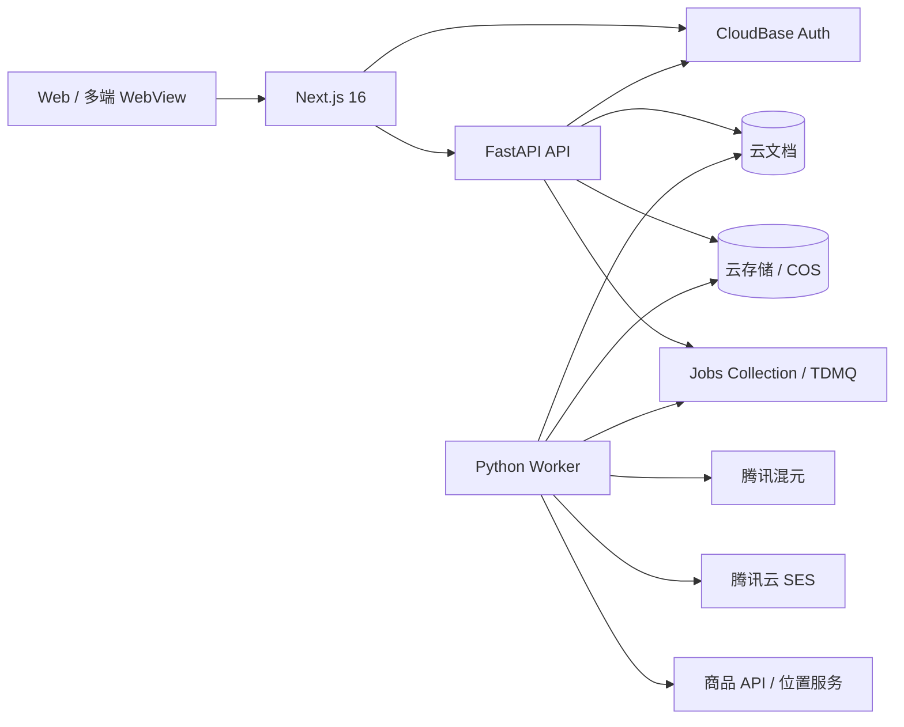

# PickGlobal 后端技术方案

本文基于 [front.md](front.md) 的产品流程、[project.md](project.md) 的国内云约束，以及当前 `front/` 中实际使用的 Next.js 16.3.3 设计。

目标是先交付可演示、可上线的国内技术栈，同时为 10 万、100 万以上用户的扩容保留清晰路径。

---

## 1. 设计结论

- 官网与工作台：现有 `front/`，Next.js 16 + TypeScript。
- 主业务 API：Python 3.12 + FastAPI + Pydantic 2。
- API 运行方式：Docker 部署到腾讯云 CloudBase 云托管。
- 异步任务：Python worker；MVP 由云函数/定时任务触发，S2 接入 TDMQ。
- MVP 数据库：CloudBase 云文档，不单独购买 MySQL。
- 文件：CloudBase 云存储或 COS，数据库只保存对象 key 和元数据。
- AI：腾讯混元，只从后端调用。
- 邮件：腾讯云 SES，只从 worker 调用。
- 商品与客户数据：国内合规数据 API + 腾讯位置服务，通过 provider adapter 隔离。
- 鉴权：CloudBase 身份认证；前端取得用户令牌，FastAPI 服务端校验。
- 部署边界：`web`、`api`、`worker` 分离，避免 AI、邮件等慢任务占用 API 请求。
- 默认不上 Java；扩容时迁数据库、队列和容器底座，不重写业务语言。

当前仓库中的 Next.js 版本是 16.3.3，因此后续配置应以实际代码为准，不按 `project.md` 中旧的 Next.js 15 描述降级。

---

## 2. 总体架构



同步接口只处理登录态、CRUD、查询和任务创建。以下工作全部异步执行：

- CSV 批量导入
- 商品和市场分析
- 混元报告生成
- 海外客户发现
- 邮件批量生成与发送
- SES 状态回调处理
- 流失识别与召回
- PDF 报告导出

---

## 3. 后端技术栈

### 3.1 API

- Python 3.12
- FastAPI
- Uvicorn
- Pydantic 2 + `pydantic-settings`
- `httpx`：异步 HTTP、CloudBase HTTP API、第三方 provider
- 腾讯云 Python SDK 3.0：SES、混元及其他腾讯云产品
- `structlog` 或标准库 JSON logging：结构化日志
- `tenacity`：仅用于可安全重试的外部调用
- `orjson`：大型分析报告的 JSON 序列化

生产环境固定依赖版本并提交 lock 文件。推荐使用 `uv` 管理依赖和虚拟环境；若团队已有 Poetry 标准，可统一使用 Poetry，但不要同时维护两套锁文件。

### 3.2 数据访问

CloudBase 服务端数据库 SDK 以 Node.js 为主。FastAPI 不应在业务代码里直接拼接数据库 HTTP 请求，而应通过 repository adapter：

```text
domain service
    ↓
repository protocol
    ├── CloudBaseDocumentRepository（MVP）
    └── MySQLRepository（S2）
```

MVP 的 Python 实现使用 CloudBase 官方 HTTP/OpenAPI 访问云文档，并集中完成：

- 腾讯云请求签名和凭证管理
- 超时、重试和错误转换
- 分页游标
- 事务封装
- 字段白名单
- 查询限制
- 结构化日志

不得把 CloudBase SecretId、SecretKey 或数据库管理能力下发到浏览器。

### 3.3 异步任务

MVP：

- `jobs` 集合保存任务状态。
- API 创建任务后立即返回 `202 Accepted`。
- CloudBase 云函数或独立 worker 拉取并执行任务。
- 定时触发器负责流失扫描和失败任务恢复。

S2：

- TDMQ 替代集合轮询作为消息队列。
- `jobs` 集合或 MySQL 继续保存业务状态，不把消息队列当数据库。
- API、analysis worker、outreach worker 可独立扩容。

所有任务必须支持幂等、超时、有限重试和死信处理。

---

## 4. 服务边界

初期采用模块化单体，不提前拆微服务：

```text
backend/
├── app/
│   ├── main.py
│   ├── api/
│   │   └── v1/
│   ├── core/
│   │   ├── config.py
│   │   ├── auth.py
│   │   ├── errors.py
│   │   ├── logging.py
│   │   └── idempotency.py
│   ├── domains/
│   │   ├── users/
│   │   ├── products/
│   │   ├── analysis/
│   │   ├── leads/
│   │   ├── campaigns/
│   │   ├── outreach/
│   │   └── recall/
│   ├── repositories/
│   │   ├── protocols.py
│   │   ├── cloudbase/
│   │   └── mysql/
│   ├── providers/
│   │   ├── hunyuan/
│   │   ├── ses/
│   │   ├── location/
│   │   └── product_sources/
│   ├── workers/
│   └── schemas/
├── tests/
│   ├── unit/
│   ├── integration/
│   └── contract/
├── Dockerfile
├── pyproject.toml
└── uv.lock
```

模块规则：

- `api` 只处理 HTTP、鉴权、输入验证和响应转换。
- `domains` 保存业务规则，不依赖 FastAPI 或具体数据库。
- `repositories` 隔离云文档和未来 MySQL。
- `providers` 隔离混元、SES、位置和商品数据源。
- `workers` 复用 domain service，不复制业务逻辑。
- 跨模块引用通过 service/protocol，不直接操作别的模块集合。

---

## 5. 核心业务流程

### 5.1 商品导入与分析

```text
录入商品 / 上传 CSV
  → 校验、去重、保存 products
  → 创建 product_analysis job
  → worker 拉取商品、税务、物流、市场数据
  → 规则引擎计算利润与风险
  → 混元生成摘要和建议
  → 保存 analysis_reports
  → 前端轮询任务或通过 SSE 获取完成状态
```

计算型字段必须由确定性代码生成，不能完全交给大模型：

- 成本、售价、平台费用
- 税费和物流费用
- 毛利率、净利率
- 时效区间
- 风险评分基础项

混元只负责非确定性内容：

- 报告摘要
- 市场机会说明
- 风险解释
- 营销建议
- 邮件草稿

报告中保存 `model`、`prompt_version`、输入摘要、生成时间和规则版本，以便追溯。

### 5.2 客户发现

```text
分析报告 / 用户筛选条件
  → 创建 lead_discovery job
  → 调用国内数据源和腾讯位置服务
  → 统一字段、去重、质量评分
  → 保存 leads
  → 用户审核后加入 campaign
```

任何 provider 都必须实现统一协议：

```python
class LeadProvider(Protocol):
    async def search(self, query: LeadSearchQuery) -> LeadSearchResult: ...
```

业务层不得依赖某一家数据源的原始字段。

### 5.3 AI 邮件触达

```text
用户选择 leads
  → 创建 campaign
  → 混元生成个性化草稿
  → 用户审核/批准
  → 创建 send jobs
  → worker 按速率限制调用 SES
  → SES webhook 更新 delivered/bounced/complained
```

首版默认“AI 生成、人工批准、系统发送”，不要默认全自动群发。

必须具备：

- 发件域名和 DKIM/SPF/DMARC 配置
- 退订链接和 suppression list
- bounce/complaint 自动停发
- 单用户、单域名、单活动发送限额
- 发送时间窗
- SES webhook 签名校验
- 模板版本与发送内容留档

### 5.4 流失召回

召回由规则引擎触发，而不是让大模型自行判断：

- 邮件已打开但指定天数未回复
- 活动进入停滞状态
- 客户曾互动但超过阈值未跟进
- 用户手动标记待召回

规则产生 `recall_jobs`，混元只生成召回文案。发送前继续执行退订、频率和 suppression 检查。

---

## 6. 数据模型

所有业务文档统一包含：

- `_id`
- `tenant_id`
- `created_by`
- `created_at`
- `updated_at`
- `version`
- `deleted_at`，如需要软删除

`tenant_id` 是强制隔离字段。所有 repository 查询必须自动带上 `tenant_id`，不能依赖 API 调用方手动传入。

### 6.1 MVP 集合

`users`

- CloudBase 用户映射、状态、语言、时区

`tenants`

- 企业信息、套餐、配额、成员设置

`tenant_members`

- `owner`、`admin`、`analyst`、`marketer`、`viewer`

`products`

- 商品基础信息、来源、成本、目标市场、归一化 SKU

`product_sources`

- 原始 provider、外部 ID、原始快照引用、同步状态

`analysis_reports`

- 规则计算结果、AI 摘要、风险、税务、物流、版本信息

`leads`

- 企业线索、地区、行业、来源、质量分、联系状态

`campaigns`

- 活动配置、受众、状态、发送策略和指标

`outreach_messages`

- 收件人、模板版本、最终内容、SES message ID、投递状态

`recall_jobs`

- 触发原因、计划时间、状态、关联 lead/campaign

`jobs`

- 任务类型、输入引用、进度、重试次数、错误和结果引用

`provider_credentials`

- 只保存 Secret Manager 引用和状态，不保存明文密钥

`audit_logs`

- 操作者、动作、资源、时间、请求 ID、变更摘要

`webhook_events`

- provider、事件 ID、签名校验结果、处理状态；用于去重

### 6.2 必备索引

- 所有主集合：`tenant_id + created_at`
- 商品：`tenant_id + normalized_sku` 唯一
- 报告：`tenant_id + product_id + created_at`
- 线索：`tenant_id + dedupe_key` 唯一
- 邮件：`tenant_id + campaign_id + status`
- 邮件：`ses_message_id`
- 任务：`status + scheduled_at`
- webhook：`provider + event_id` 唯一
- 审计：`tenant_id + created_at`

列表接口使用游标分页，不使用深度 `skip/offset`。

---

## 7. API 设计

统一前缀：`/api/v1`

### 7.1 基础接口

```text
GET    /health/live
GET    /health/ready
GET    /me
GET    /tenants/current
GET    /tenants/current/usage
```

### 7.2 商品与分析

```text
POST   /products
GET    /products
GET    /products/{product_id}
PATCH  /products/{product_id}
DELETE /products/{product_id}
POST   /products/imports
POST   /products/{product_id}/analyses
GET    /analyses/{analysis_id}
GET    /analyses/{analysis_id}/export
```

### 7.3 线索与活动

```text
POST   /lead-searches
GET    /leads
GET    /leads/{lead_id}
PATCH  /leads/{lead_id}
POST   /campaigns
GET    /campaigns
GET    /campaigns/{campaign_id}
POST   /campaigns/{campaign_id}/drafts
POST   /campaigns/{campaign_id}/approve
POST   /campaigns/{campaign_id}/send
POST   /campaigns/{campaign_id}/pause
```

### 7.4 任务和回调

```text
GET    /jobs/{job_id}
GET    /jobs/{job_id}/events
POST   /webhooks/ses
POST   /internal/jobs/{job_id}/execute
```

写接口接收 `Idempotency-Key`。长任务响应示例：

```json
{
  "data": {
    "job_id": "job_01...",
    "status": "queued",
    "resource_id": "analysis_01..."
  },
  "request_id": "req_01..."
}
```

错误响应统一：

```json
{
  "error": {
    "code": "PRODUCT_NOT_FOUND",
    "message": "商品不存在",
    "details": {}
  },
  "request_id": "req_01..."
}
```

业务错误码稳定，不把腾讯云或 provider 原始错误直接暴露给前端。

---

## 8. 鉴权与权限

请求链路：

1. 用户通过 CloudBase 身份认证登录。
2. 前端仅在 HTTPS 下携带短期访问令牌。
3. FastAPI auth middleware 校验令牌并解析 CloudBase user ID。
4. 服务端读取用户、租户和角色。
5. domain service 执行资源级权限检查。

角色权限：

- `owner`：企业、成员、套餐和全部业务数据
- `admin`：成员与全部业务操作，不可转移所有权
- `analyst`：商品、分析和线索
- `marketer`：线索、活动、邮件和召回
- `viewer`：只读

不能只做前端按钮隐藏；每个后端接口都必须执行权限检查。

内部 worker 接口不得使用普通用户 token，应使用云内服务身份、短期凭证或签名请求，并限制 VPC/来源。

---

## 9. 安全与合规

- 密钥只存腾讯云 Secret Manager 或云托管环境变量。
- 使用最小权限 CAM 子账号/角色，开发、测试、生产凭证分离。
- 所有公网流量 HTTPS；数据库和服务间优先 VPC 内网。
- 文件上传使用预签名 URL、类型白名单、大小限制和恶意文件扫描。
- 日志不记录令牌、Secret、完整邮件正文或敏感联系人字段。
- 导出和批量发送属于高风险操作，记录审计日志。
- 对登录、搜索、AI 生成、导出、发送和 webhook 分别限流。
- provider 调用设置连接超时、总超时、熔断和有限重试。
- webhook 先验签、再去重、后处理。
- 数据删除应覆盖业务文档、导出文件和可识别缓存。

产品面向美国客户且从中国基础设施发送邮件，在正式发送前必须完成：

- 数据来源授权与使用条款确认
- 中国个人信息保护与数据出境评估
- 美国 CAN-SPAM 等营销邮件要求核查
- 退订、投诉、删除和数据保留流程

这部分不能仅靠技术设计认定合规，需要法务确认后再开放自动发送。

---

## 10. 可观测性与可靠性

每个请求和任务统一携带：

- `request_id`
- `trace_id`
- `tenant_id`
- `user_id`
- `job_id`
- `provider`

关键指标：

- API QPS、P50/P95/P99 延迟、4xx/5xx
- 队列积压、任务耗时、重试率、死信数
- 混元成功率、延迟、token 用量和成本
- SES accepted/delivered/bounced/complained
- provider 成功率、限流和单次成本
- 云文档慢查询、扫描量和连接错误

告警优先级：

- P0：登录不可用、数据越权、发送失控
- P1：API 5xx 激增、任务停止消费、SES 投诉率异常
- P2：单 provider 降级、P95 变慢、成本异常

外部调用失败时保留原始错误分类和 request ID，但对用户返回可理解的稳定错误。

---

## 11. 部署与环境

环境分离：

```text
local
test
production
```

每个环境使用独立的：

- CloudBase environment
- 数据库集合
- COS bucket/prefix
- SES 配置
- 混元配额
- Secret
- webhook 地址

云托管服务：

```text
pickglobal-web
pickglobal-api
pickglobal-worker
```

容器要求：

- 非 root 用户运行
- `/health/live` 和 `/health/ready`
- 优雅退出，停止接新任务后再结束
- 镜像中不包含 `.env`、测试数据或云密钥
- API 初期使用 1–2 个 Uvicorn worker/容器，再通过容器副本水平扩容
- worker 与 API 使用同一业务代码镜像、不同启动命令

本地开发推荐：

```text
front/       Next.js :3000
backend/     FastAPI :8000
```

Next.js 通过 `NEXT_PUBLIC_API_BASE_URL` 指向 API。生产环境优先由同域反向代理暴露 `/api`，减少 CORS 和多端 WebView 的会话问题。

---

## 12. 测试策略

- 单元测试：评分、利润、税费、状态机、权限和召回规则
- repository contract test：云文档实现和未来 MySQL 实现行为一致
- provider contract test：混元、SES、位置和商品数据源
- 集成测试：CloudBase test 环境
- API 测试：鉴权、租户隔离、分页、幂等和错误码
- worker 测试：重试、超时、重复消息和死信
- 端到端测试：商品导入 → 分析 → 线索 → 草稿 → 审批 → SES sandbox

CI 最低门槛：

- lint
- type check
- unit tests
- API schema compatibility
- dependency vulnerability scan
- Docker build

真实邮件发送不能出现在普通 CI；只允许 SES sandbox 或 fake provider。

---

## 13. 分阶段实施

### Phase 0：后端骨架

- FastAPI 项目、配置、日志、错误模型
- CloudBase auth middleware
- repository/provider protocols
- Dockerfile 和健康检查
- test/production 环境隔离

### Phase 1：商品分析闭环

- 商品 CRUD 和 CSV 导入
- `jobs` 任务状态
- 确定性利润/税务/物流计算
- 混元分析摘要
- 分析报告查询和导出

### Phase 2：获客与触达

- lead provider adapter
- 线索归一化、去重和评分
- campaign 状态机
- AI 草稿与人工批准
- SES 发送、webhook、退订和 suppression

### Phase 3：召回与生产硬化

- 流失规则和 recall worker
- 审计、配额、限流和告警
- 数据删除/导出
- 故障恢复演练

### Phase 4：规模化

- 达到队列瓶颈时接入 TDMQ
- 达到对账、配额或查询瓶颈时迁 MySQL
- API 与 worker 独立扩容
- 只有云托管规格和 SLA 无法满足时才评估 TKE

---

## 14. 扩容与迁移边界

小于 10 万用户：

- Next.js + FastAPI + worker 全部云托管
- 云文档为主库
- Jobs collection + 云函数/worker

10 万至 100 万用户：

- 仍使用 FastAPI 和云托管
- 用户、租户、套餐、配额、账单、任务状态迁 MySQL
- 报告 JSON 可继续留云文档
- 接入 Redis/TDMQ，拆分 analysis/outreach worker

约 100 万用户：

- 增加云托管副本和数据库规格
- MySQL 只读副本、连接池和热点缓存
- 不因用户数直接迁 Java

超过 100 万且出现明确基础设施瓶颈：

- 相同 Docker 镜像迁 TKE
- MySQL 迁 CDB/TDSQL-C
- 网关、WAF、多可用区、独立 worker 池
- 只有真实瓶颈证明需要时才拆微服务

迁移前提是在 MVP 阶段就保持 repository、provider 和 queue adapter 边界。

---

## 15. 首版明确不做

- 不让浏览器直接调用混元、SES 或管理数据库。
- 不在 HTTP 请求中同步执行完整分析或批量发送。
- 不把金额、税费和利润交给大模型计算。
- 不默认开启无人审核的 AI 群发。
- 不引入 Java、Kubernetes、Kafka 或自建 MySQL。
- 不为每个业务模块提前拆独立微服务。
- 不把海外 SaaS、Amazon 或 Google 作为主依赖。
- 不正式购买数智人 10 小时包；只保留 provider 接口和 DEMO placeholder。

该方案的核心是：前端保持单一 Next.js 工作台，FastAPI 保持模块化单体，慢任务进入 worker，外部服务全部通过 adapter，数据层可从云文档平滑迁往 MySQL。
