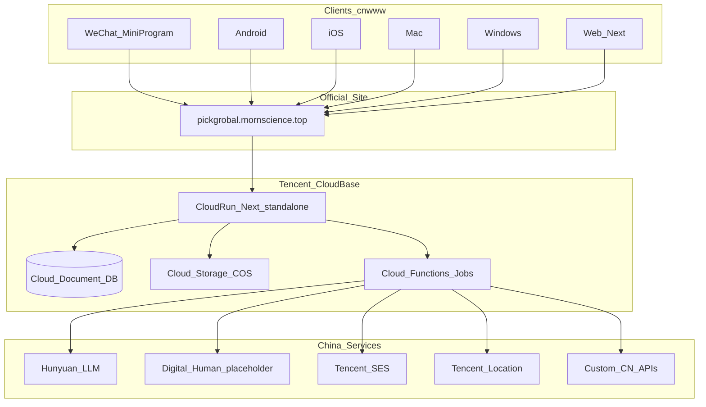

# PickGlobal（MVP 35）

**Oversea Market Selling** · 选品分析与出海获客全链路闭环

跨境卖家从选品（或自有商品）到分析、获客、触达、流失召回的一条技术闭环。  
分支流程见 [workflow.md](workflow.md)。

对照：`mvp_30` MornClient（多端）/ `mvp_28`·`mvp_24`·`mvp_1`（国内 CloudBase）/ `mvp_9/clients`。

---

## 1. 项目概要

| 项 | 说明 |
| --- | --- |
| 项目 | MVP 35 |
| 产品名 | PickGlobal |
| 域名 | [pickgrobal.mornscience.top](https://pickgrobal.mornscience.top) |
| 定位 | Oversea Market Selling（海外市场销售） |
| 一句话 | 选品分析和出海获客全链路闭环 |
| 技术原则 | **仅国内腾讯云 + 混元**；多端 mvp_30；**云托管 ≤100 万**；套餐预算 **¥29.9 / ¥299 / ¥999** |
| 全栈语言 | **Next.js（官网）+ Python FastAPI（API/Jobs）**；**可用 Python 长期**；不上 Java 除非团队强制 |

---

## 2. 业务闭环

```
跨境选品 或 自有商品
        ↓
商品分析报告（利润空间 / 税务 / 时间 / 风险）
        ↓
跨境获客
        ↓
数字人邮件触达
        ↓
流失召回
```

### 2.1 已锁定决策

| 项 | 决策 |
| --- | --- |
| 深度 | 生产级 |
| 目标市场 | 美国 + 中国（税务）；基建全部国内 |
| 商品 / 获客 | 国内 API + 腾讯位置服务（不用 Amazon / Google） |
| 触达 | 混元 + SES；数智人 **DEMO placeholder**（**不买 10h 包**） |
| DB / 计算（<10 万） | **云开发 + 云托管 + 只云文档**（**不买 MySQL**）；套餐 **¥29.9** |
| DB（≥10 万） | **MySQL**（先云开发 MySQL→自有账号；>100 万 CDB） |
| 计算（≤100 万） | **一直云托管**；>100 万才评估 TKE |
| 云开发套餐预算 | **<10 万 → ¥29.9**；**10万–100万 → ¥299**；**>100 万 → ¥999** |
| 多端 | **只做官网**，再套：微信小程序 / Android / iOS / Mac / Win |
| 后端 | **Python FastAPI** + **Next.js**；Docker 上云托管 |

### 2.2 链路要点

1. 商品 → `products`  
2. 分析（混元摘要）→ `analysis_reports`  
3. 获客 → `leads`  
4. 文案 → 数智人 placeholder → SES → `outreach_messages`  
5. 召回 → `recall_jobs`

---

## 3. 技术栈总览

| 能力 | 产品 | 用途 |
| --- | --- | --- |
| 官网 UI | CloudBase **云托管** · **Next.js 15** | SSR / 页面；套壳唯一源 |
| 业务 API / Jobs | 同环境 **云托管** · **Python FastAPI**（Uvicorn） | 分析、发信、召回、混元调用（对照 mvp_26） |
| DB <10 万 | **云文档** | 全集合 |
| DB ≥10 万 | **MySQL** + 云文档辅 | 见 §5 |
| 存储 | 云存储 / COS | 附件 |
| AI / 邮件 / 地图 | 混元 · SES · 位置服务 | 国内 |
| 客户端 | mvp_30 壳 | 五端 → cnwww |

**不用 Java** 作默认栈（重、与兄弟 MVP 不一致）。  
**可以用 Python 一直用下去**：FastAPI 打成 Docker 镜像上云托管；>100 万迁 TKE 仍是同一镜像，不必换语言。

```
浏览器 / 五端壳
    → Next.js（云托管）官网
    → FastAPI（云托管，同 VPC）← 主业务 API
         ├─ <10w：云文档
         └─ ≥10w：MySQL
```

应用层 UI：`Next.js + TypeScript + Tailwind + shadcn/ui`。  
API：`Python 3.11+ · FastAPI · Pydantic`（混元/SES SDK 用官方 Python 或 HTTP）。

### 3.1 架构图



```
客户端（WebView 套同一官网）
  → pickgrobal.mornscience.top
  → 云托管 Next
       ├─ 云文档 · 云存储 · 云函数
       └─ 混元 · SES · 位置服务 · 自定义 API
```

---

## 4. 多端（学 mvp_30 MornClient）

**原则：** 只维护一个官网；各端是壳，不另写业务 UI。

| 端 | 技术 | 分发 |
| --- | --- | --- |
| Web | Next.js 云托管 | 官网域名 |
| 微信小程序 | `web-view` → 官网 | 微信 |
| Android / iOS | Capacitor → APK / IPA | cnwww / 商店 |
| Mac / Windows | Electron → DMG / EXE | cnwww |

```
clients/
├── miniprogram/
├── mobile/{android,ios}/
├── desktop/{macos,windows}/
└── shared/
```

| 约定 | 说明 |
| --- | --- |
| 单一源 | 业务只改官网；壳只改 URL / 图标 / 包名 |
| 登录 | CloudBase / 微信；壳内跟 Web 会话 |
| 构建 | 官网 URL → 出五端包（MornClient 思路） |
| 不做 | 各端重写 RN 业务页（除非 >100 万强原生需求） |

---

## 5. 数据库：云文档 vs MySQL（及 >10 万选谁）

### 5.1 阶段策略

| 用户规模 | 底座 | DB | 说明 |
| --- | --- | --- | --- |
| **<10 万（锁定）** | **云开发 + 云托管** | **只云文档**（不买 MySQL） | Next + FastAPI 都跑云托管；数据全在云文档；套餐 ¥29.9 |
| **≥10 万（S2）** | 仍 **云开发 + 云托管** | **云开发 MySQL**（迁自有账号）+ 云文档辅 | 账户/配额走 SQL |
| ≈100 万 | 仍云托管 | MySQL 加强 | — |
| **>100 万** | 才评估 TKE | **CDB / TDSQL-C** | 云文档仅配置 |
| PostgreSQL / 境外库 | **不用** | — |

### 5.2 >10 万：云开发 vs 其它（怎么选）

| 方案 | >10 万适合？ | 优劣 |
| --- | --- | --- |
| **继续纯云文档** | ❌ 不够当主交易库 | JOIN/对账/配额弱；大集合扫描贵 |
| **云开发内 MySQL（云开发侧账号）** | △ 可起步 | 开通快、跟云托管同环境；默认偏公网、管控在云开发侧 |
| **云开发 MySQL → 迁到自有账号（VPC）** | **✅ 推荐（10万～100万）** | 仍算云开发生态；**内网**连云托管/云函数；延迟低、可自管实例；官方支持迁移 |
| **直接买 CDB MySQL**（不经云开发库） | ○ 可，若团队熟 CDB | 能力强；与云开发套餐资源点分离；要自己管 VPC/安全组；**<10～50万可不必急** |
| **TDSQL-C Serverless** | ○ 流量波动大时 | 弹性好；接口仍是 MySQL |
| **CVM 自建 MySQL** | ❌ 不推荐 | 运维重，违背云托管策略 |
| **Mongo 自建 / 其它云** | ❌ | 偏离国内统一栈 |

**结论（对应总结里那两行）：**

- **<10 万（现）**：**云开发 + 云托管 + 只云文档**，不买 MySQL。  
- **≥10 万**：「云开发 MySQL（自有账号 + VPC）」+ 文档辅。  
- **>100 万**：CDB / TDSQL-C；云文档留报告/配置。

### 5.3 集合（云文档侧；MySQL 表另建）

| 集合 | 用途 |
| --- | --- |
| `products` / `product_sources` | 商品与来源（可逐步迁 MySQL） |
| `analysis_reports` | 利润 / 税务 / 时间 / 风险（宜留文档） |
| `leads` / `campaigns` | 线索与活动 |
| `outreach_messages` | 邮件 |
| `digital_human_assets` | 数智人（placeholder） |
| `recall_jobs` | 召回 |
| `provider_credentials` / `audit_logs` | 密钥引用 / 审计 |

### 5.4 MySQL 大概多少钱（另计，不含云开发套餐）

刊例会变；内地粗算：

| 形态 | 规格感觉 | 约 ¥/月 |
| --- | --- | --- |
| **<10 万** | **不买 MySQL**（用云文档，费用打进套餐/资源点） | **¥0 独立账单** |
| 云开发 MySQL CU（Serverless 量级） | 低负载 / 可暂停 | **¥50–300** |
| 云开发 MySQL 1CU 常驻 | ≈1核+2G 量级 | **¥200–500** |
| TDSQL-C Serverless | ~0.000095 元/CCU·秒 ≈ **¥0.34/CCU·时**；1CCU 常驻满月 | **≈ ¥250** + 存储（约 ¥0.005/GB·时 → 50GB ≈ ¥180） |
| CDB 包年小规格 | 1核2G / 2核4G 高可用 | 常见 **¥100–400** 起（活动价更低）到 **¥500–1500** |
| >100 万 主从/分片 | 多节点 | **¥数千～数万+** |

**≥10 万起步建议：** 先开 **云开发 MySQL（迁自有账号）**，预算先按 **¥200–800/月** 加进 S2，而不是一上来大规格 CDB。

---

## 5b. 分档全栈清单 + 要不要调整 + 怎么迁

### 要不要调整当前锁定？

**不用改大方向。** `<10万 = 云开发 + 云托管 + 只云文档（¥29.9）` 正确。  
唯一强调：**到 ~100 万也不必换 Java**——换的是 DB/副本/队列，不是语言。

### 全栈对照（推荐路径 = 全程 Python）

| 规模 | 前端 | 后端 | 跑在哪 | DB | 套餐 |
| --- | --- | --- | --- | --- | --- |
| **<10 万** | Next.js | **Python FastAPI** | **云托管** ×2（web + api） | **只云文档** | ¥29.9 |
| **~10 万** | 同左 | **仍 FastAPI**（加 worker 副本） | **仍云托管** | **+ MySQL**（云开发→自有账号）；文档留报告 | ¥299 |
| **~100 万** | 同左 | **仍 FastAPI**（更多 api/worker） | **仍云托管**打满 | MySQL 加强 / 只读 | ¥299→999 |
| **>100 万** | 同左 | **仍 FastAPI**（可拆服务） | 才评估 **TKE** | **CDB** 主从/分片 | ¥999 |

公共不变：混元 · SES · 位置服务 · COS · 五端壳（mvp_30）。

### Java？

| | |
| --- | --- |
| ~100 万要上 Java 吗？ | **不需要** |
| 何时才考虑 Java | 团队已是 Java 主力、或强监管要求指定栈——**本项目默认不做** |
| 误区 | 「用户多 = 必须 Java」→ 错；瓶颈在数据与架构，不是 Python |

### 迁移怎么做（transfer）

```
阶段 A  <10万
  Next + FastAPI → 云托管
  全部读写 → 云文档 collection
       │
       │ 触发：对账/配额/会员算不清，或文档扫描明显慢
       ▼
阶段 B  ≥10万（~10万起）
  ① 开通云开发 MySQL → 迁自有账号（VPC，与云托管同网）
  ② 新建表：users / quotas / jobs / payments …
  ③ 双写过渡（可选）：先写 MySQL，读仍可文档；或脚本批量导出文档→MySQL
  ④ FastAPI 改连接串（SQLAlchemy/异步驱动）；**不改语言、不换前端**
  ⑤ 报告 JSON 可留云文档
  ⑥ 套餐升 ¥299；加 Redis / 队列（发信削峰）
       │
       │ 触发：≈100万，托管副本/限额吃紧，或要多 AZ SLA
       ▼
阶段 C  >100万
  ① FastAPI/Next 同一镜像迁 TKE（或继续打满云托管若仍够）
  ② MySQL → CDB/TDSQL-C（DTS 迁移）；再考虑分片
  ③ 网关 / WAF；worker 独立部署
  ④ **仍不用为迁 Java 重写**
```

**迁移检查表**

| 从 → 到 | 做什么 | 不做什么 |
| --- | --- | --- |
| A→B | 加 MySQL、改 FastAPI 数据访问层、双写/导数据 | 不重写 Next；不上 Java；不换云托管 |
| B→C | 镜像迁 TKE、DTS 迁 CDB、加副本/分片 | 不重写业务语言 |

代码预留（现在就该有）：`repository` 接口（文档实现 / SQL 实现可切换）；任务进队；`user_id` 索引字段。

---

## 5c. 名词：TKE / CDB；Python 扛得住 >100 万吗？

### TKE 是什么？

**TKE** = 腾讯云 **Tencent Kubernetes Engine**（容器服务）。  
用 Kubernetes 跑你的 Docker 镜像（Next / FastAPI），自己管副本数、滚动发布、多可用区。

| | 云托管（现在用到 ≤100 万） | TKE（>100 万才评估） |
| --- | --- | --- |
| 是什么 | 云开发里的「托管容器」，少运维 | 完整 K8s 集群，更可控也更重 |
| 谁管机器 | 腾讯云开发帮你 | 你管集群规格 / 节点池 |
| 适合 | MVP～百万级前 | 要细拆服务、自定义扩缩、强 SLA |

**一句话：** TKE 不是新语言，是 **更大一号的集装箱停车场**；镜像还是现在的 FastAPI。

### CDB 是什么？

**CDB** = 腾讯云 **Cloud DataBase**，这里指 **云数据库 MySQL**（托管 MySQL 实例）。  
同类还有 **TDSQL-C**（云原生 MySQL，可 Serverless）。

| | 云开发 MySQL（10万～100万） | CDB / TDSQL-C（>100 万） |
| --- | --- | --- |
| 定位 | 跟云开发/云托管一体，开通快 | 独立数据库产品，规格/主从/备份更强 |
| 连接 | 迁自有账号后可 VPC 内网 | VPC 内网，可只读副本、分片策略 |
| 何时上 | ≥10 万加 MySQL 时 | >100 万或要强高可用/分库时 |

**一句话：** CDB = **专业版托管 MySQL**；不是「另一种 SQL 方言」。

### Python / FastAPI 当前线程模型，>100 万扛得住吗？

**能扛，但不是靠「一个进程里多线程硬抗 100 万在线」。**

本项目是 **I/O 密集**（等 DB、混元、SES），不是纯 CPU 算力竞赛：

| 点 | 说明 |
| --- | --- |
| FastAPI 默认 | **async**（asyncio）+ Uvicorn；并发是 **事件循环等 I/O**，不是每请求一条 OS 线程打满 |
| GIL | 主要卡 **CPU 密集**；等网络时影响小。重 CPU（若有）丢 **别的进程/队列 worker** |
| 真正扩容 | **多副本**：Uvicorn `workers=N` 或多 Pod；前面 CDN/网关；慢活进 **队列** |
| 「100 万用户」 | = 注册用户，不是 100 万同时 QPS。MAU～15–25%，同时在线远更小 |
| 先爆的通常是 | **DB / 连接数 / 发信 / 混元限额**，不是 Python 语法本身 |

**结论：** >100 万 **继续用 Python FastAPI 即可**；要做的是 **水平扩展（多容器）+ MySQL/CDB + 队列**，不是换成 Java。单进程单线程「硬扛 100 万并发」任何语言都不现实。

```
用户请求 → 多副本 FastAPI（async）
              ├─ 快路径：读 Redis / MySQL
              └─ 慢路径：进队列 → worker（仍是 Python）→ 混元 / SES
```

---

## 6. 云托管 / 存储 / Jobs / AI

| 项 | 约定 |
| --- | --- |
| 云托管 | Docker → Next `standalone`；env 只挂服务端 |
| 云存储 | 报告 PDF；视频正式后再写 |
| Jobs | 导入分析、混元、SES 发送/回调、召回（数智人正式后接渲染） |
| AI | **混元**主模型；通义仅备份默认关 |
| 数智人 | DEMO placeholder，**不买 10h 包** |
| SES | 国内发信；不走境外 SaaS |
| 商品/线索 | 国内 API + 位置服务；不用 Amazon / Google Places |

密钥：CloudBase、混元、SES、位置服务、自定义 API；（Phase B）小程序 AppID；数智人密钥正式再开。

### 明确不用

Vercel · Supabase / Firebase · PostgreSQL 主库 · OpenAI/Claude/Gemini · Amazon/Google 主数据源 · 境外邮件 SaaS

---

## 7. 套餐预算 + DEMO 成本

### 7.1 云开发套餐档（按用户，你方锁定）

| 用户 | 套餐预算 | 用途 |
| --- | --- | --- |
| **<10 万** | **¥29.9/月** | 个人/入门档；云文档 + 小流量托管 |
| **10万–100万** | **¥299/月** | 标准偏上；覆盖更多资源点 |
| **>100 万** | **¥999/月** | 企业档；仍可能超限加购资源点 |

说明：控制台实际商品名可能是「个人/标准/企业」，价位以官网为准；上表为 **本项目预算锚点**。套餐 **不含** 混元、SES、独立 MySQL/CDB、数智人视频包。

### 7.2 DEMO 月估（<10 万起步、无数智人包）

| 部分 | 约 |
| --- | --- |
| 云开发套餐 | **¥29.9**（预算档） |
| 云托管（Next + FastAPI 各一） | ¥80–300 |
| 云文档 / 存储 / 函数 | ¥40–140 |
| 混元 | ¥50–150 |
| SES / 位置 | ¥0–70 |
| MySQL | **¥0**（<10 万不用） |
| **合计** | **约 ¥200–800** |

---

## 8. 规模方案（1万 / 10万 / 100万）

「用户」= 注册卖家；MAU ≈ 15–25% 注册。

### 硬规则

| 规则 | 说明 |
| --- | --- |
| **≤100 万** | 计算 **只用云托管** |
| **>100 万** | 才评估 TKE |
| 多端 | 任意档可用官网 URL 出壳 |

| 档 | 用户 | 套餐锚点 | 计算 | DB | 月成本量级（无视频） |
| --- | --- | --- | --- | --- | --- |
| DEMO/S1 | **<10 万** | **¥29.9** | **云开发 + 云托管**（Next+FastAPI） | **只云文档**（无 MySQL） | **¥0.2万–1.2万** |
| S2 | **10万–100万** | **¥299** | 仍云托管 | **MySQL（云开发）** + 文档 | **¥1.5万–5万**（含 MySQL ~¥0.02万–0.08万） |
| S3a | **≈100 万** | **¥299→999** | 仍云托管打满 | MySQL 加强 | **¥8万–25万** |
| S3b | **>100 万** | **¥999** | 才 TKE | **CDB** | **¥15万–50万+** |

**S1：** 2–4 副本；五端壳；无 MySQL / TKE / 视频包。  
**S2：** 多副本 + CDN + Redis + TDMQ；MySQL 管账户配额；**不算换计算底座**。  
**S3a：** 打满云托管规格。  
**S3b：** `web`/`api`/`worker` 拆分 + 分片。

升级信号：延迟 → 加副本；对账/发信堵 → MySQL+队列；>100 万 SLA 不够 → TKE。

---

## 9. 交付与仓库

| 阶段 | 交付 |
| --- | --- |
| A | 官网上云托管，闭环 DEMO |
| B | 官网 URL → 小程序 + Android + iOS + Mac + Win |
| C | cnwww / 商店、SES 硬化；数智人正式包另议 |

```
mvp_35/
├── app/                      # Next.js 官网
├── api/                      # FastAPI（或 backend/）
├── lib/cloudbase/
├── clients/
│   ├── miniprogram/
│   ├── mobile/{android,ios}/
│   ├── desktop/{macos,windows}/
│   └── shared/
├── cloudbase/
│   ├── Dockerfile.web
│   └── Dockerfile.api
├── project.md
└── workflow.md
```

| 交付 | 用途 |
| --- | --- |
| DEMO | 全链路（国内栈） |
| B / Y | B 站 / YouTube |

---

## 10. 兄弟项目对照

| MVP | 用途 |
| --- | --- |
| **30** | 多端主对照（URL→壳） |
| 9 | `clients/` 结构 |
| 28 | 云文档 + 微信登录 connector |
| 24 / 1 | 国内 CloudBase 业务写入 |

---

## 11. 总结

- **<10 万**：**云开发 + 云托管 + 只云文档**（¥29.9）— **不用调整**。  
- **~10 万**：Next + **FastAPI** + 云托管 + **MySQL**（¥299）；不上 Java。  
- **~100 万**：仍 FastAPI + 云托管打满 + MySQL 加强 — **不必换 Java**。  
- **>100 万**：同一 Python 镜像→**TKE**（K8s）；DB→**CDB**（托管 MySQL）；**async + 多副本可扛**，不必换 Java。  
- **迁移**：换 DB/部署，不换语言；预留 repository + 队列。  
- **多端 / 数智人**：官网套壳；placeholder。  
- 名词：**§5c**（TKE / CDB / Python 并发）。
